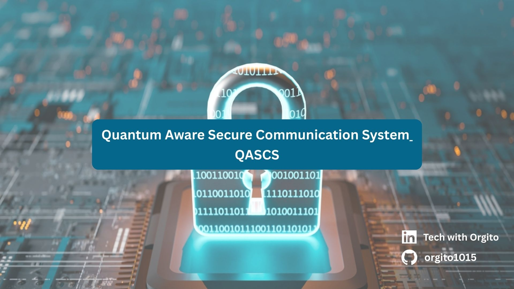

# QASCS — Quantum‑Aware Secure Communication System

A **single, focused project** that combines:

- **Quantum**: explicit threat model (Shor/Grover), and a **Quantum Risk Engine** that decides whether a crypto setup is *quantum‑safe for a data lifetime*.
- **Cybersecurity**: a working **secure client ↔ server** channel (TLS) with **crypto‑agility** (policy decides classical vs PQC/hybrid).

This repo is designed to be:
- **Runnable today** in *Classical TLS* mode (pure Python).
- **Extendable** to **Post‑Quantum / Hybrid TLS** using OQS‑OpenSSL (documented integration path).

---

## Quick start (Classical TLS demo)

### 1) Create a venv + install package
```bash
python -m venv .venv
source .venv/bin/activate  # Windows: .venv\Scripts\activate
pip install -e .  # Install the qasccs package in editable mode with dependencies
```

Or use the Makefile shortcut:
```bash
make install  # Installs package with dev dependencies (pytest)
```

### 2) Generate a self‑signed cert (dev only)
```bash
python -m qasccs.tools.gen_certs --out qasccs/secure_channel/certs
```

### 3) Run server (Terminal A)
```bash
python -m qasccs.secure_channel.server --host 127.0.0.1 --port 8443
```

### 4) Run client (Terminal B)
```bash
python -m qasccs.secure_channel.client --host 127.0.0.1 --port 8443 --data-lifetime-years 10 --data-classification high
```

You will see:
- the client asks the **Quantum Risk Engine** for a policy decision
- the channel is established using **classical TLS**
- messages are exchanged securely

---

## Quantum part (what’s actually “quantum” here?)

- `qasccs/quantum_risk_engine/` models a quantum adversary:
  - **Shor** breaks RSA/ECC (public‑key)
  - **Grover** reduces symmetric security (e.g., AES‑256 → ~128)
- It outputs a **machine‑readable decision**:
  - `risk: LOW/MEDIUM/HIGH`
  - `recommended_mode: classical | pqc | hybrid`
  - `quantum_safe_until_year`

See: `docs/threat-model.md`

---

## Post‑Quantum / Hybrid TLS (optional extension)

Pure Python cannot do PQC TLS alone. This repo includes a clean path:
- use **OQS‑OpenSSL** (OpenSSL + oqsprovider) and run `openssl s_server`/`s_client`
- keep the **same Quantum Risk Engine policy** to decide when to require PQC/hybrid

See: `docs/pqc-integration.md`

---

## Run tests
```bash
# Install package with dev dependencies first (includes pytest)
pip install -e ".[dev]"
# or: make install

# Run tests
pytest -q
```

---

## 📋 Project Management

This repository uses **GitHub Projects** for project management and issue tracking. 

### For Contributors
- Check the [Project Board](https://github.com/orgito1015/Quantum-Aware-Secure-Communication-System-QASCS-/projects) to see current priorities
- Read the [Contributing Guide](.github/CONTRIBUTING.md) before submitting PRs
- Use [Issue Templates](.github/ISSUE_TEMPLATE/) when reporting bugs or requesting features
- Review the [Project Roadmap](.github/ROADMAP.md) to see planned features

### Getting Started with GitHub Projects
- See [Project Setup Guide](.github/PROJECT_SETUP.md) for detailed instructions on creating and managing the project board
- Review [Sample Issues](.github/SAMPLE_ISSUES.md) for examples of well-structured issues

---

## Disclaimer
This project is for **learning/research**. The default certificate generation is **dev‑only** and not production‑ready.
